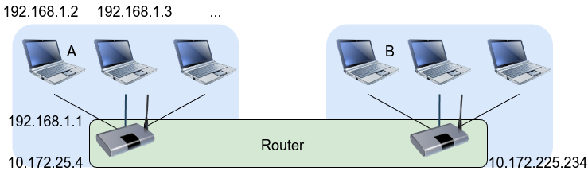

# A modified version of miniupnpd

Modification:

- **Bypass reserved IP check to adapt the intranet environment like campus network.**

  For example, you have two computers A and B behind a intranet and you wan to use tailscale on computers to simplify connections:
  
  Then you have the following facts:

  - Tailscale relies on UPnP on routers to establish direct connections between devices;
  - and your two computers have reserved IP addresses;
  - but the default miniupnpd will block the request to add port mapping for reserved IP addresses.

  So, you need to modify the miniupnpd to bypass the reserved IP check.

## Reference

- [official miniupnpd](https://miniupnp.tuxfamily.org/)